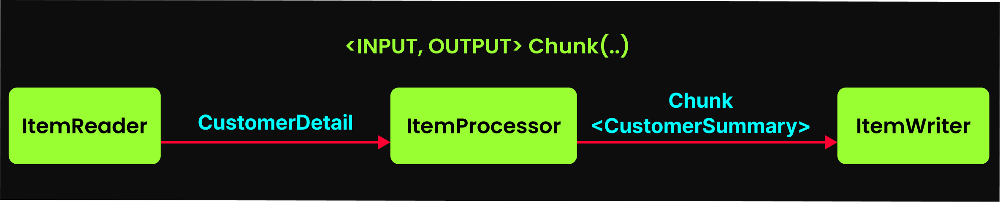
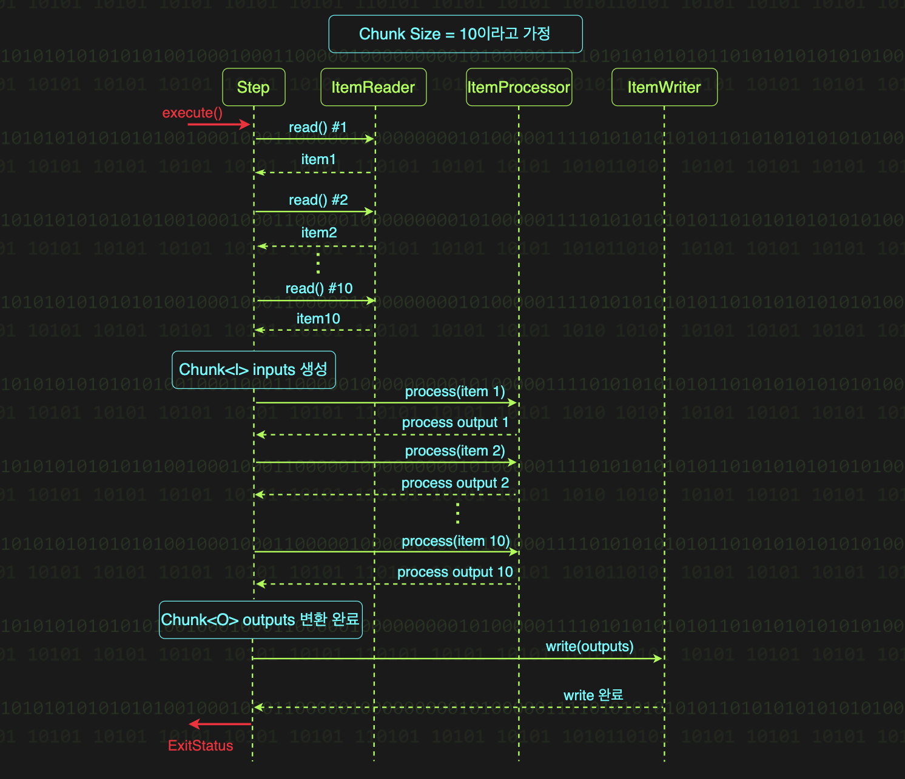

# 청크 지향 처리 (Chunk-Oriented Processing)

## 개념
Spring Batch 의 데이터를 다루는 작업은 **읽기** -> **처리** -> **쓰기** 라는 공통 패턴을 보인다.

Chunk 는 데이터를 일정 단위로 쪼갠 덩어리이며, Spring Batch 에서 데이터 기반 처리 방식을 청크 지향 처리라고 부른다.

백만 건의 데이터를 처리할 때, Spring Batch 는 전체를 한번에 읽고 처리하지 않는다. 대신 100 개씩 쪼개서 읽고 처리하고 저장한다.

이렇게 나뉜 100개의 묶음이 바로 **청크**이다

## 청크 지향 처리

100만 건의 데이터를 한 번에 메모리에 불러오고 처리하고 저장한다면?
- 메모리는 터진다.
- DB는 과부하에 걸린다.
- 전체 시스템이 폭발한다.

1. 메모리를 지켜서 데이터의 양을 줄임
100만 건을 한 번에 메모리에 올리지 않고, DB에 적절한 양의 데이터를 가져온다.
- 100개 씩 나눠서 불러온다.
- 개념적으로, 메모리엔 단 100개의 데이터만 존재한다.

이 방식으로 메모리 사용량은 안정적이고, 시스템은 무리없이 데이터를 처리한다.

2. 가벼운 트랜잭션
트랜잭션은 작업의 성공 또는 실패를 하나의 단위로 묶는 것이다. 하지만 100만 건을 하나의 트랜잭션으로 처리한다면, 작업 중간에 오류가 발생할 경우 100만 건이 전부 롤백된다.
- 청크 단위로 트랜잭션을 나눈다. 따라서 데이터 100개 단위로 처리가 성공하면 커밋하고, 실패하면 롤백한다.

만약 작업 중간에 에러가 발생하는 경우
- 이전 청크는 이미 커밋 완료
- 에러가 발생한 청크만 롤백되고 해당 청크부터 재시작하면 된다.

즉, 복구가 쉽고 빠르다. 청크는 작지만 강력한 복구 시스템이며 작업의 실패를 작은 실패로 제한해준다.

## 청크 지향 처리의 3 작업 - 읽기, 가공, 쓰기

배치 처리는 읽기(ItemReader), 가공(ItemProcessor), 쓰기(ItemWriter) 로 청크 지향 처리가 완료 된다.

### ItemReader - 데이터를 끌어온다

데이터를 읽어오는 것은 배치의 생명줄이다.
```java
public interface ItemReader<T> {
    T read() throws Exception, 
        UnexpectedInputException, 
        ParseException, 
        NonTransientResourceException;
}
```
- read(): 아이템을 하나씩 반환한다(T 타입 리턴) 여기서 아이템이란 파일의 한 줄 또는 데이터베이스의 한 행(row)과 같이 데이터 하나를 의미한다. 
예를 들어, 총 100만 건의 레코드가 있다면, 각각의 레코드를 아이템이라고 부른다. 
ItemReader는 데이터 소스(DB, 파일 등)에서 데이터를 하나씩 순차적으로 읽어온다.
읽을 데이터가 더 이상 없으면 `null`을 반환하며, 스텝은 종료된다.
**ItemReader** 가 `null` 을 반환하는 것이 청크 지향 처리 Step 의 종료 시점이다.
이는 Spring Batch 가 Step 의 완료를 판단하는 핵심 조건이다.

- 다양한 구현체 제공: Spring Batch 는 파일, 데이터베이스, 메시지 큐 등 다양한 데이터 소스에 대한 표준 구현체를 제공한다.
예를 들어, FlatFileItemReader 는 CSV 나 텍스트 파일에서 데이터를 읽어오고, JdbcCursorItemReader 는 관계형 데이터베이스로 부터 데이터를 읽어온다.

### ItemProcessor - 데이터를 가공한다

ItemProcessor 는 데이터를 원하는 형태로 가공한다. ItemReader 가 넘긴 원재료를 받아서 필요한 모양으로 다듬는 작업을 한다.
```java
public interface ItemProcessor<I, O> {
    O process(I item) throws Exception;
}
```
- 데이터 가공: 입력데이터(`I`) 를 원하는 형태(`O`) 로 변환한다. 읽어온 원본 데이터를 비즈니스 로직에 맞게 가공하거나 출력 시스템이 요구하는 형식으로 변환하는 작업이다.
- 필터링: null을 반환하면 해당 데이터는 처리 흐름에서 제외된다. 즉 ItemWriter 로 전달되지 않는다. 유효하지 않은 데이터나 처리할 필요가 없는데이터를 걸러낼 때 사용한다.
- 데이터 검증: 입력 데이터의 유효성을 검사한다. 필터링과 달리 조건에 맞지 않는 데이터를 만나면 예외를 발생시킨다. 필수 필드 누락이나 잘못된 데이터 형식을 발견했을 때 예외를 던져 Batch Job을 중단시킨다.
- 필수 아님: ItemProcessor 는 생략 가능하다. Step 이 데이터를 읽고 바로 쓰도록 구성할 수 있다.

### ItemWriter - 결과물을 기록

ItemWriter 는 ItemProcessor 가 만든 결과물을 받아, 원하는 방식으로 최종 저장/출력한다. - 데이터를 DB 에 `INSERT` / 파일에 `WRITE` / 메시지 큐에 `PUSH` 등
```java
public interface ItemWriter<T> {
    void write(Chunk<? extends T> chunk) throws Exception;
}
```
- 한 덩어리씩 쓴다: ItemWriter 는 데이터를 한 건씩 쓰지 않는다. Chunk 단위로 묶어서 한 번에 데이터를 쓴다. `write()` 메서드의 파라미터 타입이 `chunk` 인 것에 주목해야한다. ItemReader 와 ItemProcessor 가 아이템을 하나씩 반환하고 입력받는 것과 달리, ItemWriter 는 데이터 덩어리를 한 번에 입력받아 한 번에 쓴다.
- 다양한 구현체 제공: Spring Batch 는 파일, 데이터베이스, 외부 시스템 전송 등에 사용할 수 있는 다양한 구현체를 제공한다. FlatFileItemWriter 는 파일에 데이터를 기록하고, JdbcBatchItemWriter 는 데이터베이스에 데이터를 저장한다.


> **Reader-Processor-Writer 패턴**
> 
> itemReader, ItemProcessor, ItemWriter 로 구성된 청크 지향 처리의 장점
> 
> 1. 완벽한 책임 분리
> 
> 각 컴포넌트는 자신의 역할만 수행한다. ItemReader 는 읽기, ItemProcessor는 가공, ItemWriter 는 쓰기에만 집중한다. 덕분에 코드는 명확해지고 유지보수는 간단해진다.
> 
> 2. 재사용성 극대화
> 
> 컴포넌트들은 독립적으로 설계되어 있어 어디서든 재사용 가능하다. 새로운 배치를 만들 때도 기존 컴포넌트들을 조합해서 빠르게 구성할 수 있다.
> 
> 3. 높은 유연성
> 
> 요구사항이 변경되어도 해당 컴포넌트들만 수정하면 된다. 데이터 형식이 바뀌면 ItemProcessor만, 데이터 소스가 바뀌면 ItemReader만 수정하면 된다. 이런 독립성 덕분에 변경에 강하다. 
> 
> 4. 대용량 처리의 표준
> 
> 데이터를 다루는 배치 작업은 결국 '읽고-처리하고-쓰는' 패턴을 따른다. Spring Batch 는 이 패턴을 완벽하게 구조화했다.
> 
> 결론: ItemReader, ItemProcessor, ItemWriter 로 구성된 이 패턴은 대용량 데이터를 처리하기 위한 최적의 아키텍처이다.

## 청크 지향 처리 조립

```java
@Bean
public Step processStep(JobRepository jobRepository, PlatformTransactionManager transactionManager) {
    return new StepBuilder("processStep", jobRepository)
            .<CustomerDetail, CustomerSummary>chunk(10, transactionManager) // 청크 지향 처리 활성화
            .reader(itemReader())                                           // 데이터 읽기 담당
            .processor(itemProcessor())                                     // 데이터 처리 담당
            .writer(itemWriter())                                           // 데이터 쓰기 담당
            .build();
}

@Bean
public Job customerProcessingJob(JobRepository jobRepository, Step processStep) {
    return new JobBuilder("customerProcessingJob", jobRepository)
            .start(processStep) // processStep 으로 Job 시작
            .build();
}
```

### 1) 청크 사이즈 지정
```java
.chunk(10, transactionManager)
```
`chunk()` 메서드의 첫번째 파라미터로 청크의 크기를 지정한다. 여기서는 `10`을 지정했는데, 이는 데이터를 10개씩 묶어서 처리하겠다는 의미이다.
ItemReader가 데이터 10개를 읽어오면, 이를 하나의 청크로 만들어 ItemProcessor에서 처리하고 ItemWriter에서 쓰기를 수행한다.

### 2) 제네릭 타입으로 데이터 흐름 정의
```java
.<CustomerDetail, CustomerSummary>chunk(...)
```
`chunk()`메서드의 제네릭 타입을 지정해 청크 처리 과정에서의 데이터 타입 변환 흐름을 정의한다.

- 첫번째 타입(CustomerDetail): ItemReader 가 반환할 타입. 파일에서 읽은 데이터를 CustomerDetail 객체로 변환하여 반환한다.
- 두번째 타입(CustomerSummary): CustomerDetail을 입력받은 ItemProcessor가 아이템을 처리한 후 반환할 타입이자 ItemWriter 가 전달받을 Chunk의 제네릭 타입이다.

전체적인 흐름
1. ItemReader 는 read() 호출마다 CustomerDetail 객체를 반환한다.
2. ItemProcessor 는 CustomerDetail 타입을 입력받아 가공 로직을 수행한 후 CustomerSummary 로 변환하여 반환한다.
3. 반환된 CustomerSummary 들이 청크 단위로 모여 Chunk<CustomerSummary> 가 된다.
4. 최종적으로 이 Chunk<CustomerSummary> 가 ItemWriter.write() 메서드의 파라미터로 전달된다.



## 청크 지향 처리의 흐름
### reader()
>ItemReader 구현체를 전달받아 Step의 읽기 작업을 담당할 컴포넌트를 등록한다.

ItemReader는 데이터 소스에서 하나씩 데이터를 읽어온다. `read()` 메서드가 호출될 때 마다 데이터를 순차적으로 반환하며, 청크 크기만큼 데이터를 읽어야한다. 다시 말해, 청크 크기가 10이면 `read()`가 10번 호출되어 하나의 청크가 생성된다. 

### processor()
>ItemProcessor 구현체를 전달받아 Step의 처리 작업을 담당할 컴포넌트로 등록한다. ItemProcessor가 필요하지 않다면 생략 가능하며, 이 경우 ItemReader가 읽은 데이터 그대로 ItemWriter로 전달된다.

ItemProcessor 는 ItemReader 가 읽어온 청크의 각 아이템 하나씩을 처리한다.

process() 메서드는 청크 전체를 받지 않는다. 청크 안의 각 아이템을 하나씩 받아서 처리한다는게 포인트이다.

Spring Batch는 청크 내부의 아이템마다 `process()`를 반복 호출해서 데이터를 변환하거나 필터링한다.

즉, 청크 크기가 10이면 `process()` 가 10번 호출된다.

### writer()
>ItemWriter 구현체를전달받아 Step 의 쓰기 작업을 담당할 컴포넌트로 등록한다.

ItemWriter는 청크 단위로 데이터를 저장한다. ItemReader/ItemProcessor가 각각 아이템을 하나씩 처리하는 것과 달리, ItemWriter는 청크 전체를 한 번에 처리한다.

Spring Batch 는 청크 내 아이템들을 하나씩 처리한 결과를 하나로 묶어 ItemWriter에게 전달하는데, 이는 `write()` 메서드의 파라미터 타입이 `Chunk<? extends T>` 인것만봐도 알 수 있다.

청크 크기가 10인 경우 흐름
1. 읽기: `read()`가 10번 호출돼서 10개의 데이터를 가져와 하나의 청크를 생성한다.
2. 가공: `process()`가 10번 호출되며 청크의 각 데이터를 하나씩 처리한다.
3. 쓰기: 처리된 10개의 아이템이 하나의 청크로 묶여 `write()` 에 전달된다. ItemWriter의 write() 메서드는 이 청크를 한번에 저장하거나 출력한다.
4. 이 과정이 모든 데이터를 전부 처리할 때 까지 반복된다.



## 청크 단위 반복의 종료 조건

Spring Batch 에서 모든 데이터를 처리할 때 까지 위 과정을 반복하며 더 이상 읽을 데이터가 없을 때가 모든 데이터를 처리한 때 이다.

더 이상 읽을 데이터가 없는지 확인하는 방법은 `read()` 메서드가 판단한다.

ItemReader 의 read 메서드가 null을 반환할 때, Spring Batch 는 청크 단위 반복을 종료한다.

### 예시로 보는 반복 종료

총 97개의 데이터를 청크 크기 10으로 처리하는 상황을 가정

#### 처음 9번의 반복
처음 9번의 반복에서는 청크 사이즈만큼 데이터가 존재하여 깔끔하게 처리된다. 매번 10개의 데이터를 읽어오고, 이를 청크로 만들어 처리하고 쓰는 과정이 반복된다.
- 각 반복마다 read() 메서드가 10번씩 호출되면서 데이터를 하나씩 읽어온다
- 읽어온 10개의 데이터로 하나의 청크를 구성한다
- 이 과정이 9번 박복되어 총 90개의 데이터가 처리 된다

#### 마지막 10번째 반복
남은 데이터가 7개 남았을 때 청크 사이즈(10개)를 채우지 못한다.
- read() 호출 1~7번: 남은 7개의 데이터를 정상적으로 읽어온다. 이전 반복들과 동일하게 진행된다
- read() 호출 8번째: read() 메서드가 `null`을 반환한다. 이는 더 이상 읽을 데이터가 없다는 신호이며, Spring Batch 는 이번이 반복의 마지막이라고 내부적으로 표시한다.
- 지금까지 읽어온 7개의 데이터로 청크를 구성한다. 청크 사이즈가 10이 아니여도 문제없다.
- 7개의 데이터에 대해 ItemProcessor와 ItemWriter가 작업을 수행한다.
- Spring Batch Step은 마지막 반복 표시를 확인하고 반복을 종료한다. 즉 청크 지향 처리 Step 의 실행이 완료된다.

## 청크 처리와 트랜잭션
데이터를 청크 단위로 처리한다는 건 트랜잭션도 청크단위로 관리된다는 의미이다.

각각의 청크 단위 반복 마다 별도의 트랜잭션이 시작되고 커밋된다.

### 청크 단위 트랜잭션의 의미
대용량 데이털르 처리하는 도중 중간에 스텝이 실패하더라도, 이전 청크 처리 반복에서 처리된 데이터는 이미 안전하게 커밋되어 있어 그만큼 작업은 보존된다.

실패한 청크의 데이터만 롤백 되므로, 전체 데이터를 처음부터 다시 처리할 필요가 없다.

### 적절한 청크 사이즈
트레이드오프와 업무 요구사항, 데이터의 양을 고려해서 적절히 선택해야한다.

#### 청크 사이즈가 큰 경우
- 그만큼 메모리에 많은 데이터를 한 번에 로드하게 된다.
- 트랜잭션의 경계가 커지므로, 문제 발생 시 롤백되는 데이터의 양도 많아진다.

#### 청크 사이즈가 작은 경우
- 트랜잭션의 경계가 작아져서 문제 발생 시 롤백되는 데이터가 최소화 된다.
- 그만큼 읽기/쓰기 I/O가 자주 발생하게 된다. 건당 10ms 가 소요되는 요청을 100만번 호출하게 되면, 약 2.77(10ms * 100만 = 10,000,000ms) 소요된다.
